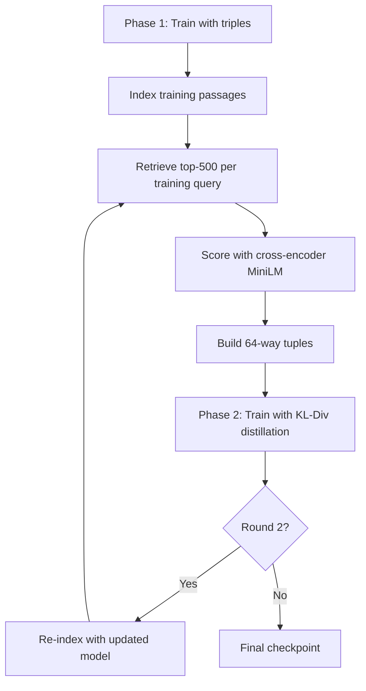
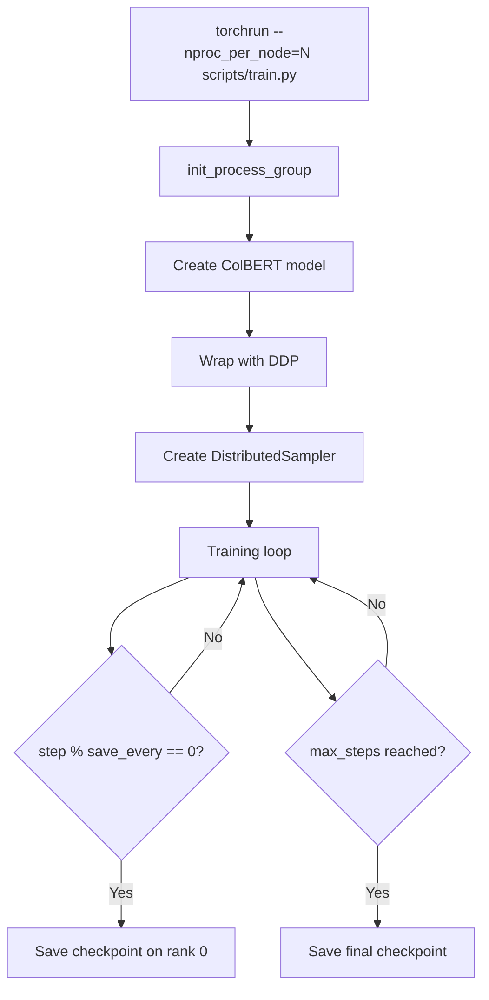
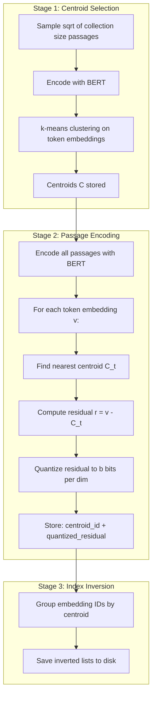
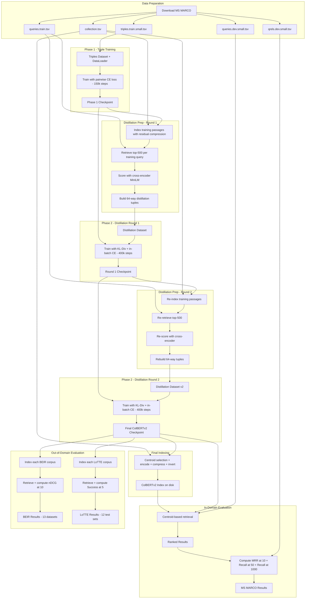

# ColBERTv2 Training — Architecture Plan

## Overview

A clean, from-scratch reimplementation of **ColBERTv2** (Contextualized Late Interaction over BERT v2) for passage retrieval on MS MARCO, incorporating the key improvements from the [ColBERTv2 paper](https://arxiv.org/abs/2112.01488):

1. **Denoised supervision** — cross-encoder distillation with KL-Divergence loss + in-batch negatives
2. **Residual compression** — centroid-based encoding with quantized residuals (6–10× smaller index)
3. **Custom inverted-list retrieval** — replaces FAISS nearest-neighbor search at query time

The implementation covers the full pipeline:
1. **Data preparation** — download and preprocess MS MARCO passage ranking dataset
2. **Training Phase 1** — fine-tune BERT with late interaction using triples (ColBERT v1 style)
3. **Training Phase 2** — distill from cross-encoder with hard negatives (ColBERTv2 denoised supervision)
4. **Indexing** — centroid selection, passage encoding with residual compression, inverted list construction
5. **Retrieval & Evaluation on MS MARCO** — centroid-based candidate generation + exact MaxSim re-ranking
6. **Out-of-domain evaluation** — zero-shot evaluation on BEIR (13 datasets, nDCG@10) and LoTTE (12 test sets, Success@5)

---

## Project Structure

```
colbert_training/
├── pyproject.toml                 # Project metadata and dependencies
├── README.md                      # Usage instructions
├── configs/
│   └── default.yaml               # Default hyperparameters and paths
├── scripts/
│   ├── download_msmarco.sh        # Shell script to download MS MARCO data
│   ├── download_beir.py           # Download BEIR benchmark datasets
│   ├── download_lotte.py          # Download LoTTE benchmark datasets
│   ├── train.py                   # Training entry point (Phase 1: triples)
│   ├── distill.py                 # Distillation entry point (Phase 2: denoised supervision)
│   ├── index.py                   # Indexing entry point
│   ├── evaluate.py                # Retrieval + evaluation on MS MARCO
│   ├── evaluate_beir.py           # Zero-shot evaluation on BEIR benchmarks
│   └── evaluate_lotte.py          # Zero-shot evaluation on LoTTE benchmarks
├── colbert/
│   ├── __init__.py
│   ├── config.py                  # Configuration dataclass
│   ├── modeling/
│   │   ├── __init__.py
│   │   ├── colbert.py             # ColBERT model (query + doc encoders)
│   │   ├── tokenization.py        # Query/document tokenizers with padding
│   │   └── similarity.py          # MaxSim scoring function
│   ├── data/
│   │   ├── __init__.py
│   │   ├── download.py            # MS MARCO download utilities
│   │   ├── download_beir.py       # BEIR dataset download + loading
│   │   ├── download_lotte.py      # LoTTE dataset download + loading
│   │   ├── collection.py          # Passage collection reader
│   │   ├── queries.py             # Query reader
│   │   ├── triples.py             # Training triples dataset (Phase 1)
│   │   ├── distillation.py        # Distillation tuples dataset (Phase 2)
│   │   └── ranking.py             # Qrels and ranking file utilities
│   ├── training/
│   │   ├── __init__.py
│   │   ├── trainer.py             # Training loop with DDP (Phase 1)
│   │   ├── distill_trainer.py     # Distillation training loop (Phase 2)
│   │   ├── loss.py                # CE loss (Phase 1), KL-Div + in-batch CE (Phase 2)
│   │   └── utils.py               # Checkpointing, logging, etc.
│   ├── distillation/
│   │   ├── __init__.py
│   │   ├── score_passages.py      # Score retrieved passages with cross-encoder
│   │   └── build_tuples.py        # Build w-way distillation tuples
│   ├── indexing/
│   │   ├── __init__.py
│   │   ├── encoder.py             # Batch-encode collection passages
│   │   ├── residual_codec.py      # Residual compression: centroid + quantized residual
│   │   ├── index_builder.py       # Three-stage indexing pipeline
│   │   └── saver.py               # Save/load index artifacts
│   └── evaluation/
│       ├── __init__.py
│       ├── retriever.py           # Centroid-based candidate gen + exact MaxSim re-rank
│       ├── metrics.py             # MRR@10, Recall@50, Recall@1000, nDCG@10, Success@5
│       ├── beir_evaluator.py      # BEIR benchmark evaluation orchestrator
│       └── lotte_evaluator.py     # LoTTE benchmark evaluation orchestrator
├── tests/
│   ├── test_model.py
│   ├── test_tokenization.py
│   ├── test_similarity.py
│   ├── test_residual_codec.py
│   └── test_retriever.py
└── plans/
    └── architecture.md            # This file
```

---

## Key ColBERTv2 Changes vs ColBERT v1

| Aspect | ColBERT v1 | ColBERTv2 |
|--------|-----------|-----------|
| **Training data** | `<q, d+, d->` triples (BM25 negatives) | 64-way tuples from hard-negative mining + cross-encoder scores |
| **Loss** | Pairwise softmax cross-entropy | KL-Divergence distillation + in-batch cross-entropy |
| **Embedding storage** | 256 bytes/vector (fp16) | 20–36 bytes/vector (centroid ID + quantized residual) |
| **Index** | FAISS IVF for ANN search | Custom inverted list grouped by centroid |
| **Retrieval** | FAISS per-token search → re-rank | Centroid probing → decompress → approximate MaxSim → re-rank |
| **Index size (MS MARCO)** | ~154 GiB | ~16–25 GiB |
| **MRR@10 (MS MARCO dev)** | 36.0% | 39.7% |

---

## Component Design

### 1. Configuration — `colbert/config.py`

A single `ColBERTConfig` dataclass holding all hyperparameters:

| Parameter | Default | Description |
|-----------|---------|-------------|
| `checkpoint` | `bert-base-uncased` | Pretrained model name or path |
| `query_maxlen` | 32 | Max query token length |
| `doc_maxlen` | 180 | Max document token length |
| `dim` | 128 | ColBERT embedding dimension |
| `similarity` | `cosine` | Similarity metric |
| `mask_punctuation` | True | Mask punctuation tokens in documents |
| `batch_size` | 32 | Training batch size per GPU |
| `accumulation_steps` | 1 | Gradient accumulation steps |
| `lr` | 1e-5 | Learning rate |
| `warmup` | 20000 | Linear warmup steps |
| `max_steps` | 400000 | Maximum training steps |
| `nranks` | 1 | Number of GPUs for DDP |
| `nway` | 64 | Number of passages per distillation example |
| `nbits` | 2 | Bits per dimension for residual compression |
| `nprobe` | 2 | Centroids probed per query token during retrieval |
| `ncandidates` | 8192 | Candidate passages for re-ranking (nprobe * 2^12) |
| `triples` | path | Path to training triples file |
| `collection` | path | Path to passage collection |
| `queries` | path | Path to queries file |
| `index_path` | path | Where to store the index |
| `cross_encoder` | `cross-encoder/ms-marco-MiniLM-L-6-v2` | Cross-encoder for distillation scoring |
| `top_k_distill` | 500 | Top-k passages retrieved per query for distillation |
| `distill_rounds` | 2 | Number of distillation rounds |

Loaded from YAML via `configs/default.yaml` with CLI overrides.

### 2. Tokenization — `colbert/modeling/tokenization.py`

Two tokenizer wrappers using HuggingFace `BertTokenizerFast`:

- **QueryTokenizer**: Prepends `[Q]` marker token (mapped to `[unused0]`), pads to exactly `query_maxlen` with `[MASK]` tokens (query augmentation via mask tokens is a key ColBERT design choice).
- **DocTokenizer**: Prepends `[D]` marker token (mapped to `[unused1]`), truncates to `doc_maxlen`, optionally masks punctuation embeddings.

Both return `input_ids`, `attention_mask` tensors.

### 3. Model — `colbert/modeling/colbert.py`

```
┌─────────────────────────────────────────────┐
│                  ColBERT                     │
│                                              │
│  ┌──────────┐    ┌─────────────┐             │
│  │ BERT     │───>│ Linear      │──> L2 Norm  │
│  │ encoder  │    │ 768 -> 128  │             │
│  └──────────┘    └─────────────┘             │
│                                              │
│  Shared encoder for queries and documents    │
│  Differentiated by [Q]/[D] marker tokens     │
└─────────────────────────────────────────────┘
```

- Single `BertModel` backbone shared between query and document encoding
- A linear projection layer: `768 → dim` (default 128)
- L2 normalization on output embeddings
- `query()` method: encode + normalize, keep all token embeddings including `[MASK]` padding
- `doc()` method: encode + normalize, filter out padding and optionally punctuation tokens
- `score()` method: calls MaxSim

The model architecture is **unchanged** from ColBERT v1 — ColBERTv2's improvements are in supervision and compression, not the encoder itself.

### 4. Similarity — `colbert/modeling/similarity.py`

**MaxSim** — the late interaction mechanism:

```
score(Q, D) = Σ_i max_j Q_i · D_j^T
```

For each query token embedding, find the maximum similarity with any document token embedding, then sum across all query tokens. Implemented as batched matrix multiplication + max + sum.

### 5. Data Pipeline — `colbert/data/`

#### Download — `download.py` + `scripts/download_msmarco.sh`

Downloads from the official MS MARCO repository:
- `collection.tsv` — ~8.8M passages
- `queries.train.tsv`, `queries.dev.small.tsv`
- `qrels.train.tsv`, `qrels.dev.small.tsv`
- `triples.train.small.tsv` — training triples (query, positive, negative)

#### Triples Dataset — `triples.py` (Phase 1)

A `torch.utils.data.Dataset` that:
1. Reads `triples.train.small.tsv` (tab-separated: query, pos_passage, neg_passage text)
2. Returns raw text triples
3. Collation handled by a custom `collate_fn` that tokenizes on-the-fly

#### Distillation Dataset — `distillation.py` (Phase 2)

A `torch.utils.data.Dataset` for 64-way distillation tuples:
1. Reads precomputed tuples: `(query, [passage_1, ..., passage_64], [score_1, ..., score_64])`
2. Each tuple has exactly one positive (labeled or highest-scoring by cross-encoder)
3. Returns query text, passage texts, and cross-encoder scores
4. Custom `collate_fn` tokenizes query and all 64 passages

### 6. Training — `colbert/training/`

Training follows a **two-phase** approach:



#### Phase 1: Triple-based Training — `trainer.py`

Standard ColBERT training with:
- Pairwise softmax cross-entropy loss
- BM25 negatives from triples file
- ~150k steps as pre-finetuning
- DDP with `torchrun`

#### Phase 2: Distillation Training — `distill_trainer.py`

ColBERTv2 denoised supervision:
- **KL-Divergence loss**: distill cross-encoder scores into ColBERT
- **In-batch negatives**: cross-entropy loss where each querys positive is scored against all other passages in the batch
- 64-way tuples (1 positive + 63 negatives from top-500 retrieved)
- 400k steps total
- Two rounds (re-index and re-retrieve after first round)

#### Loss — `loss.py`

```python
# Phase 1: Pairwise softmax cross-entropy
scores = torch.stack([scores_pos, scores_neg], dim=-1)
loss_ce = CrossEntropyLoss(scores, labels)  # labels = 0 (positive is index 0)

# Phase 2: KL-Divergence distillation
colbert_scores = model.score(Q, D_all)          # (batch, nway)
teacher_scores = softmax(cross_encoder_scores)   # (batch, nway)
student_scores = log_softmax(colbert_scores)     # (batch, nway)
loss_kl = KLDivLoss(student_scores, teacher_scores)

# Phase 2: In-batch cross-entropy negatives
# For each query, score its positive against all passages in batch
pos_scores = model.score(Q_all, D_pos_all)       # (batch, batch) matrix
loss_ib = CrossEntropyLoss(pos_scores, arange(batch))

loss = loss_kl + loss_ib
```

#### DDP Launch Flow



### 7. Distillation Pipeline — `colbert/distillation/`

This is the **hard-negative mining + cross-encoder scoring** step between Phase 1 and Phase 2.

#### Score Passages — `score_passages.py`

1. Load cross-encoder model (`cross-encoder/ms-marco-MiniLM-L-6-v2`, 22M params)
2. For each training query, receive list of top-k retrieved passages
3. Score each (query, passage) pair with the cross-encoder
4. Return scores alongside passage IDs

#### Build Tuples — `build_tuples.py`

1. For each training query, take top-500 retrieved passages + cross-encoder scores
2. Select positive: labeled positive passage OR highest-scored by cross-encoder
3. Sample 63 negatives from remaining passages (lower-ranked)
4. Save as 64-way tuples: `(query_id, [pid_1, ..., pid_64], [score_1, ..., score_64])`

### 8. Indexing — `colbert/indexing/`

ColBERTv2 uses a **three-stage** indexing pipeline, replacing FAISS ANN search with custom inverted lists.



#### Residual Codec — `residual_codec.py`

The core compression mechanism:

**Encoding:**
1. Given vector `v` (128-dim, L2-normalized)
2. Find nearest centroid `C_t` from the set `C`
3. Compute residual `r = v - C_t`
4. Quantize each dimension of `r` into `b` bits (1 or 2):
   - For `b=1`: threshold at 0 → 1 bit per dim → 16 bytes for 128 dims
   - For `b=2`: 4 quantization levels per dim → 2 bits per dim → 32 bytes for 128 dims
5. Store: `centroid_id` (4 bytes) + `quantized_residual` (16 or 32 bytes) = **20 or 36 bytes** per vector

**Decoding:**
1. Look up centroid `C_t` from centroid_id
2. Dequantize residual `r̃` from quantized bits
3. Reconstruct: `ṽ = C_t + r̃`

**Centroid count:** `|C| = round_to_power_of_2(16 × √n_embeddings)`
- For MS MARCO (~600M token embeddings): `|C| ≈ 2^18 = 262,144`

#### Index Builder — `index_builder.py`

Orchestrates the three indexing stages:

1. **Centroid Selection**:
   - Sample passages proportional to `√collection_size`
   - Encode sampled passages with BERT
   - Run k-means (via FAISS) on the sampled token embeddings
   - Store centroids

2. **Passage Encoding**:
   - Iterate all passages in batches
   - Encode with BERT → per-token 128-dim embeddings
   - Compress each embedding via `ResidualCodec`
   - Write compressed embeddings to disk in chunks

3. **Index Inversion**:
   - Group embedding IDs by their assigned centroid
   - Build inverted list: `centroid_id → [embedding_id_1, embedding_id_2, ...]`
   - Save inverted list to disk

### 9. Retrieval & Evaluation — `colbert/evaluation/`

#### Retriever — `retriever.py`

ColBERTv2 retrieval uses **centroid-based candidate generation** instead of FAISS:


**Step by step:**
1. Encode query into `Q` (N token embeddings, each 128-dim)
2. For each query vector `Q_i`, find `nprobe` nearest centroids (default 2)
3. Use inverted list to collect all embedding IDs near those centroids
4. Decompress those embeddings using `ResidualCodec`
5. Compute cosine similarity between each decompressed embedding and every query vector
6. Group scores by passage ID; for each passage × query token pair, take the max similarity
7. Sum the max similarities across query tokens → approximate MaxSim
8. Select top `ncandidates` passages (default `nprobe × 4096`)
9. Load full compressed embeddings for candidate passages, decompress all their tokens
10. Compute exact MaxSim using all token embeddings
11. Sort by score, return top-k

#### Metrics — `metrics.py`

- **MRR@10** — primary MS MARCO metric
- **Recall@50, Recall@1000** — secondary MS MARCO metrics
- **nDCG@10** — primary BEIR metric (normalized discounted cumulative gain)
- **Success@5** — primary LoTTE metric (fraction of queries with a relevant passage in top-5)
- Compare against qrels, output results to console and file

#### BEIR Evaluator — `beir_evaluator.py`

Orchestrates zero-shot evaluation across BEIR benchmark datasets:

1. Load each BEIR dataset (corpus, queries, qrels)
2. Index the corpus using the trained ColBERTv2 model + residual compression
3. Retrieve top-k passages per query
4. Compute nDCG@10 per dataset
5. Report per-dataset and average results

**BEIR datasets** (13 publicly available):

| Category | Dataset | Passages | Test Queries |
|----------|---------|----------|--------------|
| Search | DBPedia | 4.6M | 400 |
| Search | FiQA-2018 | 57K | 648 |
| Search | NQ | 2.7M | 3,452 |
| Search | HotpotQA | 5.2M | 7,405 |
| Search | NFCorpus | 3.6K | 323 |
| Search | TREC-COVID | 171K | 50 |
| Search | Touche-2020 | 383K | 49 |
| Semantic | ArguAna | 8.7K | 1,406 |
| Semantic | Climate-FEVER | 5.4M | 1,535 |
| Semantic | FEVER | - | - |
| Semantic | Quora | 523K | 10,000 |
| Semantic | SCIDOCS | 26K | 1,000 |
| Semantic | SciFact | 5.2K | 300 |

**Key config overrides for BEIR/LoTTE:**
- `doc_maxlen` = 300 (vs 180 for MS MARCO)
- `query_maxlen` = 300 for ArguAna (long document queries)
- `query_maxlen` = 64 for Climate-FEVER (long sentence claims)
- `nprobe` = 2 default; 4 for large collections

#### LoTTE Evaluator — `lotte_evaluator.py`

Orchestrates zero-shot evaluation across LoTTE benchmark:

1. Load each LoTTE topic corpus + query sets (search and forum)
2. Index the corpus
3. Retrieve top-5 passages per query
4. Compute Success@5 — award a point if an accepted/upvoted answer from target page appears in top-5
5. Report per-topic and pooled results

**LoTTE test sets** (12 total: 6 topics × 2 query types):

| Topic | Passages | Search Queries | Forum Queries |
|-------|----------|---------------|---------------|
| Writing | ~100K–2M | 500–2000 | 500–2000 |
| Recreation | ~100K–2M | 500–2000 | 500–2000 |
| Science | ~100K–2M | 500–2000 | 500–2000 |
| Technology | ~100K–2M | 500–2000 | 500–2000 |
| Lifestyle | ~100K–2M | 500–2000 | 500–2000 |
| Pooled | aggregated | aggregated | aggregated |

- **Search queries**: natural Google autocomplete queries from GooAQ, matched to StackExchange answers
- **Forum queries**: StackExchange post titles matched to answer posts
- Each topic aggregates multiple StackExchange communities

---

## Full Pipeline Flow



---

## Key Design Decisions

1. **Shared BERT encoder** — One `bert-base-uncased` model (110M params) encodes both queries and documents, differentiated only by the `[Q]`/`[D]` marker tokens. Unchanged from v1.

2. **Query augmentation with MASK** — Queries are padded to `query_maxlen` using `[MASK]` tokens. BERT contextualizes these masks, effectively learning additional soft query expansion terms.

3. **Punctuation masking** — Document-side punctuation token embeddings are zeroed out, as they carry little semantic information and waste index space.

4. **Two-phase training** — Phase 1 trains with standard triples (BM25 negatives) to produce a reasonable model. Phase 2 uses that model to mine hard negatives, score them with a cross-encoder, and distill via KL-Divergence. This denoised supervision is the primary quality improvement in ColBERTv2.

5. **Cross-encoder teacher** — A small MiniLM cross-encoder (22M params, `cross-encoder/ms-marco-MiniLM-L-6-v2`) is used for scoring — strong quality with efficient inference, suitable for scoring millions of query-passage pairs.

6. **KL-Divergence + in-batch negatives** — KL-Div handles the scale mismatch between ColBERT scores (sum of cosines) and cross-encoder logits. In-batch cross-entropy provides additional negative signal without extra computation.

7. **Residual compression** — Exploits the observation that ColBERT token embeddings cluster tightly by semantic meaning. Each vector is stored as centroid ID (4 bytes) + quantized residual (16–32 bytes), reducing storage by 6–10×.

8. **Custom inverted-list retrieval** — Instead of FAISS ANN search, ColBERTv2 uses its centroid-based inverted list for candidate generation. FAISS is used only for k-means clustering during indexing.

9. **DDP training** — PyTorch DistributedDataParallel with `torchrun` launcher. Each GPU processes its own micro-batch; gradients are synchronized automatically.

10. **AMP** — Mixed precision training with `torch.amp` for memory efficiency on modern GPUs.

---

## Dependencies

| Package | Purpose |
|---------|---------|
| `torch >= 2.0` | Model, training, DDP |
| `transformers >= 4.30` | BERT model, tokenizer, cross-encoder |
| `sentence-transformers` | Cross-encoder wrapper for distillation scoring |
| `faiss-gpu` or `faiss-cpu` | k-means clustering only (not ANN search) |
| `beir` | BEIR benchmark data loading and evaluation |
| `numpy` | Embedding storage and manipulation |
| `tqdm` | Progress bars |
| `pyyaml` | Configuration loading |
| `tensorboard` | Training logging |
| `requests` | Data download |
| `pytrec_eval` | nDCG and other IR metrics computation |

---

## Entry Points

### Phase 1: Triple Training
```bash
torchrun --nproc_per_node=4 scripts/train.py --config configs/default.yaml
```

### Distillation Prep (index + retrieve + score + build tuples)
```bash
python scripts/index.py --config configs/default.yaml --checkpoint path/to/phase1_ckpt --collection data/collection.tsv
python scripts/distill.py --config configs/default.yaml --checkpoint path/to/phase1_ckpt --index_path path/to/index
```

### Phase 2: Distillation Training
```bash
torchrun --nproc_per_node=4 scripts/train.py --config configs/default.yaml --init_from path/to/phase1_ckpt --tuples path/to/tuples --mode distill
```

### Final Indexing
```bash
python scripts/index.py --config configs/default.yaml --checkpoint path/to/final_ckpt --collection data/collection.tsv
```

### Evaluation — MS MARCO
```bash
python scripts/evaluate.py --config configs/default.yaml --checkpoint path/to/final_ckpt --index_path path/to/index
```

### Evaluation — BEIR (zero-shot, 13 datasets)
```bash
python scripts/evaluate_beir.py --config configs/default.yaml --checkpoint path/to/final_ckpt --beir_data_dir data/beir/
```

### Evaluation — LoTTE (zero-shot, 12 test sets)
```bash
python scripts/evaluate_lotte.py --config configs/default.yaml --checkpoint path/to/final_ckpt --lotte_data_dir data/lotte/
```

---

## Hyperparameters (from paper Appendix)

| Parameter | Value | Notes |
|-----------|-------|-------|
| Encoder | `bert-base-uncased` | 110M parameters, shared |
| Embedding dim | 128 | Output of linear projection |
| Query max length | 32 | Default; 64 for long queries |
| Document max length | 180 | 300 for BEIR/LoTTE |
| Learning rate | 1e-5 | |
| Batch size | 32 | Per example |
| Warmup | 20,000 steps | Linear warmup with decay |
| Phase 1 steps | 150,000 | Pre-finetuning |
| Phase 2 steps | 400,000 | Distillation training |
| Distillation nway | 64 | Passages per training example |
| Top-k for distillation | 500 | Retrieved passages scored by cross-encoder |
| Distillation rounds | 2 | Re-index after first round |
| Compression bits | 2 | Bits per residual dimension |
| nprobe | 2 | Centroids probed per query token (4 for large collections) |
| ncandidates | nprobe × 4096 | Candidates for re-ranking |
| Centroid count | 2^18 | For MS MARCO (~600M embeddings) |

---

## Expected Results

### In-Domain: MS MARCO Passage Ranking dev set

| Metric | ColBERT v1 | ColBERTv2 |
|--------|-----------|-----------|
| **MRR@10** | 36.0% | **39.7%** |
| **Recall@50** | 82.9% | **86.8%** |
| **Recall@1000** | 96.8% | **98.4%** |
| **Index size** | ~154 GiB | **~25 GiB** (2-bit) |

### Out-of-Domain: BEIR (nDCG@10, selected)

| Dataset | ColBERT v1 | ColBERTv2 |
|---------|-----------|-----------|
| DBPedia | 39.2 | **44.6** |
| FiQA | 31.7 | **35.6** |
| NQ | 52.4 | **56.2** |
| HotpotQA | 59.3 | 66.7 |
| NFCorpus | 30.5 | **33.8** |
| TREC-COVID | 67.7 | **73.8** |
| SciFact | 67.1 | **69.3** |
| FEVER | 77.1 | **78.5** |

### Out-of-Domain: LoTTE Test (Success@5, selected)

| Topic | ColBERT v1 (Search) | ColBERTv2 (Search) | ColBERT v1 (Forum) | ColBERTv2 (Forum) |
|-------|---------------------|-------------------|--------------------|--------------------|
| Writing | 74.7 | **80.1** | 71.0 | **76.3** |
| Recreation | 68.5 | **72.3** | 65.6 | **70.8** |
| Science | 53.6 | **56.7** | 41.8 | **46.1** |
| Technology | 61.9 | **66.1** | 48.5 | **53.6** |
| Lifestyle | 80.2 | **84.7** | 73.0 | **76.9** |
| Pooled | 67.3 | **71.6** | 58.2 | **63.4** |

---

## Implementation Notes

- **FAISS usage**: Only for k-means clustering during centroid selection. All nearest-neighbor search at retrieval time uses the custom inverted-list mechanism.
- **Memory management during indexing**: Centroid selection uses only a sample of passages (proportional to √collection_size), avoiding the need to store all embeddings in memory before clustering.
- **Two-round distillation**: The paper notes preliminary experiments indicate quality has low sensitivity to initialization and two-round training. For simplicity, implement single-round first, add second round as optional.
- **MS MARCO training queries**: ~800k total, but only ~500k have labels. Distillation uses all 800k queries; positives are labeled passages or top-ranked by cross-encoder.
